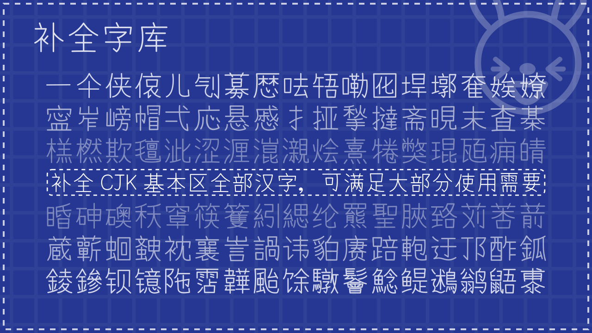
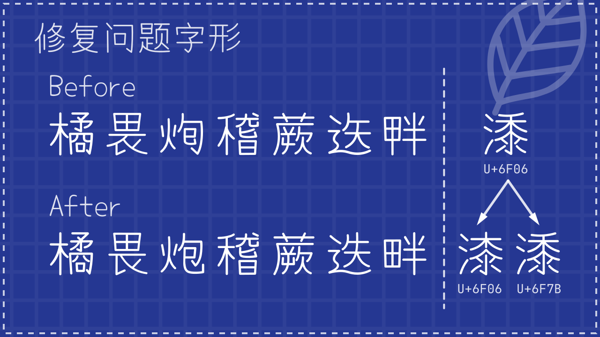

# 有梦体 / 有夢體 / Yomeng Script

本字体由 [Yomogi](https://github.com/satsuyako/YomogiFont) 字体二次开发而成。

## 介绍
### 1. 补全字库
补全 CJK 基本区内全部汉字，可满足大部分使用需要。 \

### 2. 字形本土化
将大部分汉字调整为更符合陆标的字形，少部分汉字或部件为维持原有风格，保留原有字形或采用折中写法。 \

### 3. 翻新部分汉字
翻新原字体当中部分风格差异较大的汉字，加强风格一致性。 \

### 4. 修复问题字形
修复原字体中一些笔画或码位存在问题的汉字。 \

## 授权信息
本字体在 [Yomogi](https://github.com/satsuyako/YomogiFont) 字体的基础上二次开发，采用 SIL OFL Font License 1.1 授权许可。
### 您可以
- 无论是企业还是个人都可以自由商用本字体，无需付费、知会或标明作者。
- 本字体可以自由传播、分享或嵌入于系统、软件中。
- 本字体可以自由修改或制作衍生字体，修改后的字体也必须同样以 SIL OFL 1.1 协议公开。
### 您不可以
- 衍生字体不可以使用或出现“有梦体”、“有夢體”、“Yomeng”等保留名称。
- 根据 SIL OFL Font License 1.1 的规定，禁止单独出售字体文件的行为。
- 本字体不可用于违法用途，若产生法律诉讼或纠纷，作者不承担任何责任。
- 本字体不可以在 SIL OFL Font License 1.1 以外的授权许可下发行。

## 鸣谢
- [Satsuyako](https://github.com/satsuyako/) 提供原版日文字体 [Yomogi](https://github.com/satsuyako/YomogiFont)

## 备注
- 本人并非专业的字体设计师，且字数庞大，制作时间跨度较长，制作方法又经过多次调整，因此难免会出现部分汉字的质量或风格参差不齐的状况。
- 由于学业原因，后续的更新与改进可能会有所滞后。